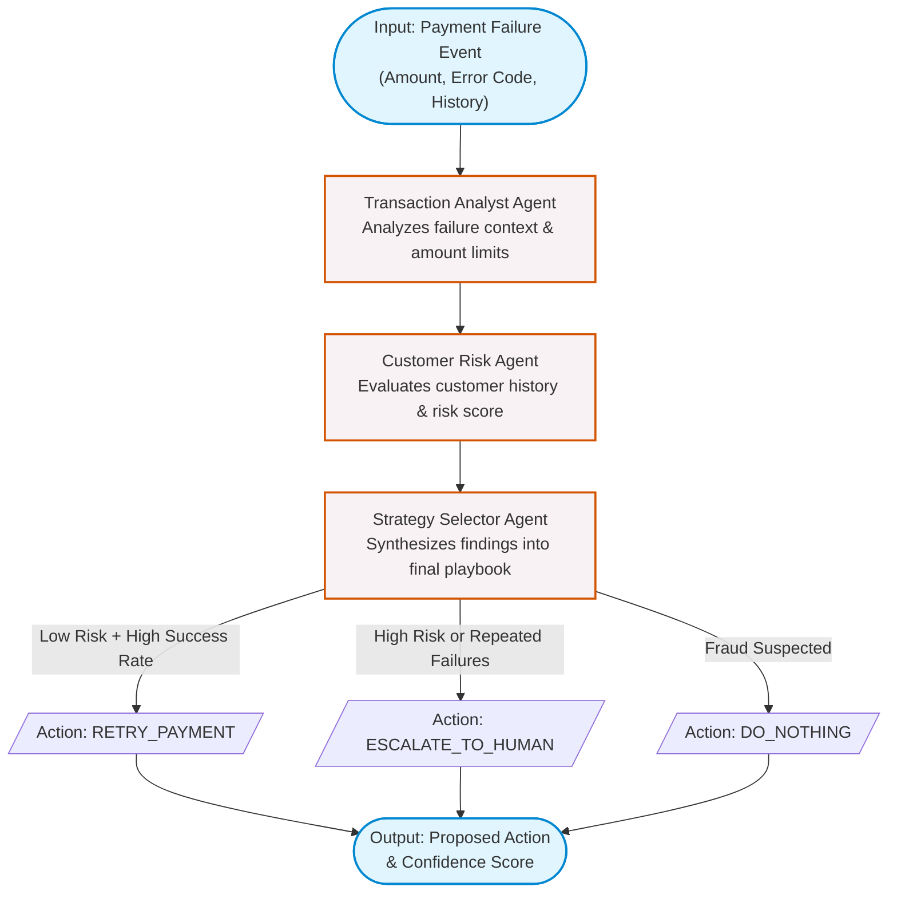

# RecoverAI Agentic Service

LangGraph-powered stateful multi-agent consensus council which analyses payment failure events to formulate recovery strategies.

## Features
- **Multi-Agent Flow**: Coordinates Transaction Analyst, Customer Risk Guard, and Strategy Selection agents using state graph routing.
- **Reasoning Council**: Selects recovery playbooks based on transactional risk metrics and customer success records.

## Getting Started

### Prerequisites
- Python 3.11

### Environment Variables
Create a `.env` file in the root `ai-service` directory:
```env
OPENAI_API_KEY=your-openai-api-key
GEMINI_API_KEY=your-gemini-api-key
BACKEND_URL=http://localhost:8000
```

### Setup & Run
1. Create virtual environment and install dependencies:
   ```bash
   python -m venv .venv
   source .venv/bin/activate
   pip install -r requirements.txt
   ```
2. Start the development FastAPI server:
   ```bash
   uvicorn app.main:app --host 0.0.0.0 --port 8001 --reload
   ```
3. Run tests:
   ```bash
   pytest
   ```

## Connection to Backend
The AI Service runs as an independent microservice (`http://localhost:8001`) and exposes a single deterministic endpoint (`POST /analyze-event`) for the backend to consume. 
- When a payment fails, the backend's `worker.py` dispatches the case context (amount, failure code, historical success rate) to this AI service.
- The AI council processes the event and returns a structured JSON response containing the proposed `action` (e.g., `RETRY_PAYMENT`), `confidence_score`, and detailed `reasoning`.
- The backend then takes this AI-proposed action and enforces hard constraints via the deterministic **ActionGuard** before execution.

## AI Reasoning Council Workflow

The following Mermaid diagram illustrates the LangGraph state machine and the interaction between the specialized LLM agents when evaluating a failed payment case.



## Detailed Flow Explanation

The multi-agent workflow operates synchronously in a pipeline pattern powered by LangGraph. When a payment failure event occurs, the context (amount, failure reason, and customer risk profile) is ingested into the graph state and evaluated iteratively by distinct AI personas:

1. **Transaction Analyst Agent**: 
   - **Scope**: Focuses exclusively on the immediate transactional context (e.g., amount, currency, network error codes like `INSUFFICIENT_FUNDS` vs `NETWORK_ERROR`).
   - **Output**: Generates a summary of transactional feasibility, such as recommending immediate retries for network errors, but blocking retries for permanent failures like stolen cards.

2. **Customer Risk Agent**:
   - **Scope**: Assesses historical behavior, such as the customer's payment success rate and predefined risk score.
   - **Output**: Flags high-risk customers or customers who have failed consecutive payments.

3. **Strategy Selector Agent**:
   - **Scope**: The consensus node. It ingests the outputs from both the Analyst and Risk agents.
   - **Output**: Synthesizes the analysis into a final actionable playbook:
     - `RETRY_PAYMENT`: Issued when risk is low and error is transient.
     - `ESCALATE_TO_HUMAN`: Issued when risk is high, amount is large, or multiple attempts have already been exhausted.
     - `DO_NOTHING`: Issued for hard declines (fraud, stolen card).

### Model Selection & Strategy
For this implementation, the service seamlessly integrates with foundational LLMs (such as OpenAI's **GPT-4o** or Google's **Gemini 1.5 Pro**) to drive the reasoning engines. 

The models are guided using strict system prompts designed for deterministic classification, and their responses are strictly parsed into structured JSON schemas. By offloading the subjective "playbook" decision to a multi-agent LLM council, the system dynamically handles nuanced edge cases that static IF/ELSE rules miss. Finally, a downstream deterministic **ActionGuard** sits outside the AI layer to ensure the models never violate hard business constraints (e.g., executing retries over ₹5000 without a human operator override).
